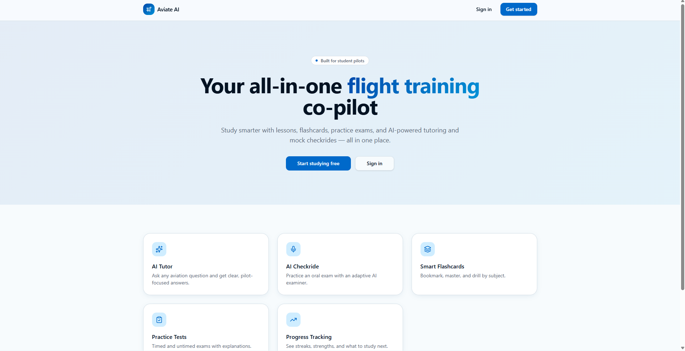
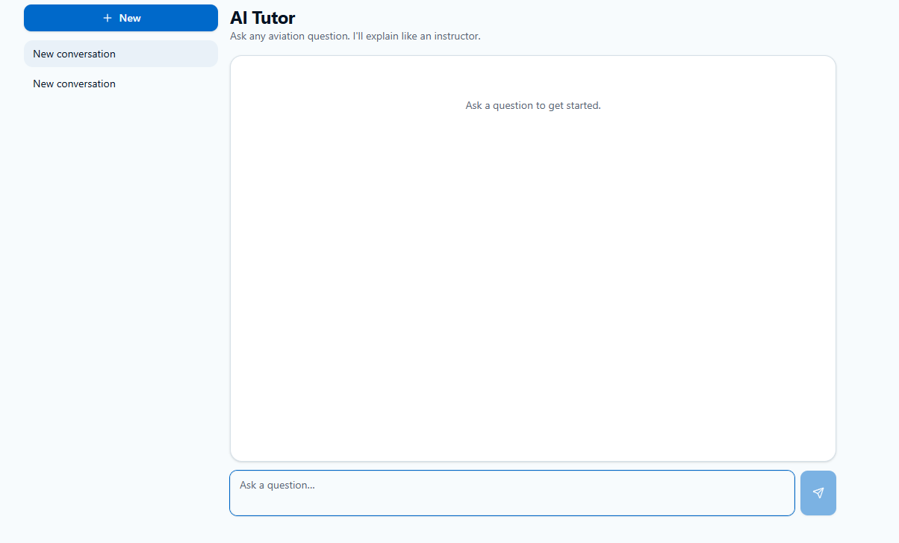
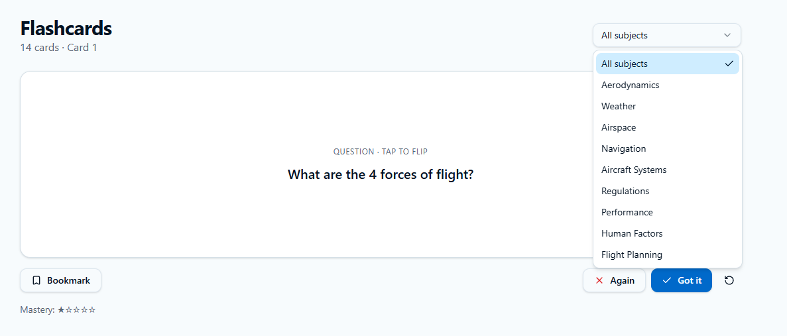
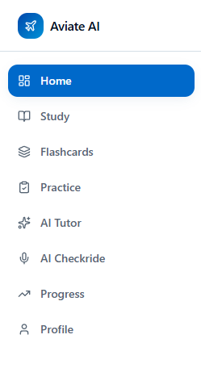
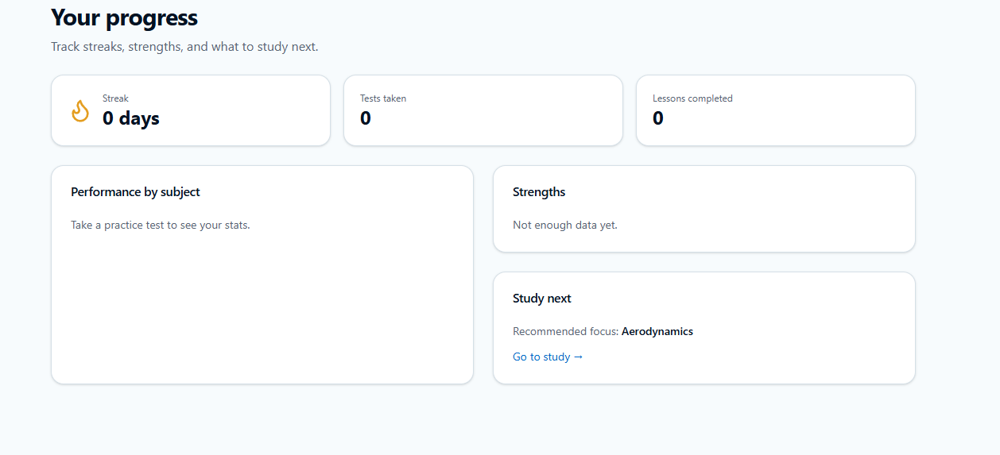

# Aviate Ai ✈️

## Overview

 Aviate Ai is an AI-powered aviation learning platform designed to help student pilots study more effectively throughout their flight training journey. The platform provides personalized learning tools, practice assessments, progress tracking, and AI-assisted tutoring to help users build confidence and develop a deeper understanding of aviation concepts.

Rather than replacing traditional flight instruction, SkyStudy is designed to complement it by providing students with an accessible and organized learning environment where they can review material, practice for written exams, and prepare for oral checkrides at their own pace.

---
 
## Mission

Our mission is to make aviation education more accessible, engaging, and effective by combining modern technology with proven learning methods. SkyStudy encourages active learning and critical thinking while helping students stay organized throughout their training.

---

## Features

- 🤖 AI-powered aviation tutor
- 📚 Personalized study plans
- ✅ Practice quizzes and mock exams
- 📈 Progress tracking and performance analytics
- 📝 Checkride and oral exam preparation
- ✈️ Flight training study resources
- 🔍 Smart search for aviation topics
- 📱 Responsive and user-friendly interface

---
    

## Target Audience

 Aviate Ai is designed for:

- Student pilots
- Private Pilot License (PPL) students
- Instrument Rating students
- Commercial Pilot students
- Flight instructors
- Aviation enthusiasts

---

## Why This Project?

Learning to fly requires mastering a large amount of technical knowledge while balancing flight lessons, ground school, and exam preparation. SkyStudy was created to simplify this process by bringing study resources into one intelligent platform that adapts to each student's learning needs.

---

## Future Plans

Some planned features include:

- AI-generated practice checkrides
- Flashcards with spaced repetition
- Interactive aircraft systems diagrams
- Flight planning tools
- Weather interpretation practice
- Performance calculations
- Mobile application
- Multi-language support

---

## Technologies

This project is currently being developed using modern web technologies and AI tools, including:

- HTML
- CSS
- JavaScript
- React
- Node.js
- AI APIs
- Git & GitHub

---

## Status

🚧 This project is currently under active development.

New features, improvements, and bug fixes are added regularly.

---

## Author

Developed by **Mashal Alshahrani**

GitHub: https://github.com/MashalAlshahrani21

---

## License

This project is intended for educational purposes.

© 2026 Mashal Alshahrani. All rights reserved.

## 📸 Screenshots

### Home Page

### AI Tutor

### Study Topics

### Flashcards

### Progress Dashboard

